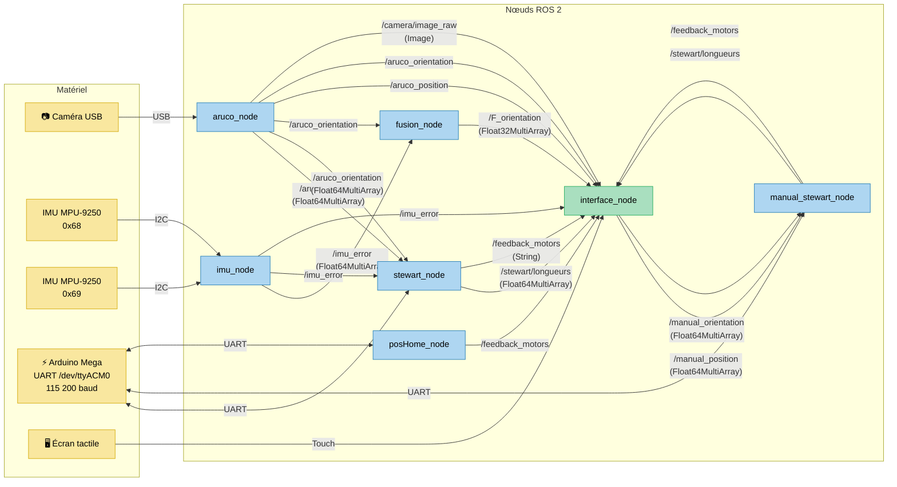

# Architecture — Stewart Platform ROS 2

> **Package** : `stewart_control`
> **Middleware** : ROS 2 Jazzy — ament_python / colcon
> **Matériel** : Raspberry Pi 5, Arduino Mega 2560, 2 × MPU-9250, Caméra USB, Écran tactile

---

## 1. Vue d'ensemble

Le système pilote une plate-forme de Stewart (hexapode 6 actionneurs linéaires)
à partir de mesures capteurs fusionnées (IMU + vision ArUco).
Deux modes de commande coexistent :

| Mode | Nœuds actifs | Launch file |
|------|-------------|-------------|
| **Automatique** (capteurs) | `imu_node`, `aruco_node`, `fusion_node`, `stewart_node`, `interface_node` | `stewart_ordered_launch.py` |
| **Manuel** (écran tactile) | `manual_stewart_node`, `interface_node` | `manual_launch.py` |
| **Retour position home** | `posHome_node` | `launch_posHome.py` |

---

## 2. Diagramme des nœuds et topics



---

## 3. Topics ROS 2

| Topic | Type | Éditeur(s) | Abonné(s) |
|-------|------|-----------|-----------|
| `/aruco_position` | `Float64MultiArray` | `aruco_node` | `stewart_node`, `interface_node` |
| `/aruco_orientation` | `Float64MultiArray` | `aruco_node` | `stewart_node`, `fusion_node`, `interface_node` |
| `/camera/image_raw` | `sensor_msgs/Image` | `aruco_node` | `interface_node` |
| `/imu_error` | `Float64MultiArray` | `imu_node` | `stewart_node`, `fusion_node`, `interface_node` |
| `/F_orientation` | `Float32MultiArray` | `fusion_node` | `interface_node` |
| `/stewart/longueurs` | `Float64MultiArray` | `stewart_node`, `manual_stewart_node` | `interface_node` |
| `/feedback_motors` | `String` | `stewart_node`, `manual_stewart_node`, `posHome_node` | `interface_node` |
| `/manual_position` | `Float64MultiArray` | `interface_node` | `manual_stewart_node` |
| `/manual_orientation` | `Float64MultiArray` | `interface_node` | `manual_stewart_node` |

---

## 4. Description des nœuds

### 4.1 `aruco_node`

| | |
|---|---|
| **Fichier** | `stewart_control/aruco_node.py` |
| **Rôle** | Détection de marqueurs ArUco par caméra USB. Calcule la position et l'orientation relative entre un marqueur fixe (ID 34) et un marqueur mobile (ID 28). |
| **Capteur** | Caméra USB — Dictionnaire `DICT_4X4_50` |
| **Publie** | `/aruco_position`, `/aruco_orientation`, `/camera/image_raw` |
| **Timer** | Configurable via `aruco.loop_rate` (YAML) |

### 4.2 `imu_node`

| | |
|---|---|
| **Fichier** | `stewart_control/imu_node.py` |
| **Rôle** | Lecture de 2 IMU MPU-9250 via I2C (RTIMULib). Calcule l'erreur d'orientation (différence entre les deux IMU). |
| **Capteurs** | IMU 1 (0x68) — base fixe, IMU 2 (0x69) — plate-forme mobile |
| **Publie** | `/imu_error` (roll, pitch, yaw en degrés) |
| **Timer** | Configurable via `imu.publish_rate` (YAML) |

### 4.3 `fusion_node`

| | |
|---|---|
| **Fichier** | `stewart_control/fusion_node.py` |
| **Rôle** | Fusion d'orientation IMU + ArUco. Utilise 3 filtres de Kalman 1D (roll, pitch, yaw) + moyenne pondérée pour le yaw. |
| **Souscrit** | `/imu_error`, `/aruco_orientation` |
| **Publie** | `/F_orientation` |
| **Paramètres** | `fusion.kalman_roll/pitch/yaw.q/r`, `fusion.alpha_yaw_mean` (YAML) |

### 4.4 `stewart_node` (mode automatique)

| | |
|---|---|
| **Fichier** | `stewart_control/stewart_node.py` |
| **Rôle** | Contrôle automatique — reçoit les données capteurs, calcule la cinématique inverse (longueurs d'actionneurs) et envoie les consignes à l'Arduino via UART. |
| **Souscrit** | `/imu_error`, `/aruco_position`, `/aruco_orientation` |
| **Publie** | `/stewart/longueurs`, `/feedback_motors` |
| **Série** | `/dev/ttyACM0` @ 115200 baud |
| **Cinématique** | `inv_kinematics.StewartPlatform` — modèle hexapode (rb=0.075, rp=0.04) |

### 4.5 `manual_stewart_node` (mode manuel)

| | |
|---|---|
| **Fichier** | `stewart_control/manual_stewart_node.py` |
| **Rôle** | Contrôle manuel — reçoit position/orientation depuis l'interface tactile, calcule la cinématique inverse et pilote les actionneurs. |
| **Souscrit** | `/manual_position`, `/manual_orientation` |
| **Publie** | `/stewart/longueurs`, `/feedback_motors` |
| **Série** | `/dev/ttyACM0` @ 115200 baud |

### 4.6 `posHome_node`

| | |
|---|---|
| **Fichier** | `stewart_control/posHome_node.py` |
| **Rôle** | Envoie la consigne « retour position home » (vecteur de zéros) à l'Arduino. |
| **Publie** | `/feedback_motors` |
| **Série** | `/dev/ttyACM0` @ 115200 baud |

### 4.7 `interface_node`

| | |
|---|---|
| **Fichier** | `stewart_control/interface_node.py` |
| **Rôle** | Interface graphique tactile (tkinter). Affiche les données capteurs, le flux caméra, les longueurs d'actionneurs et les retours moteurs. Permet la commande manuelle via sliders. |
| **Souscrit** | `/imu_error`, `/F_orientation`, `/stewart/longueurs`, `/feedback_motors`, `/aruco_position`, `/aruco_orientation`, `/camera/image_raw` |
| **Publie** | `/manual_position`, `/manual_orientation` |

---

## 5. Firmware Arduino

| | |
|---|---|
| **Fichier** | `arduino/pilotage_feedback_mp.ino` |
| **MCU** | Arduino Mega 2560 |
| **Liaison** | USB-UART @ 115200 baud (`/dev/ttyACM0`) |
| **Protocole** | Réception de 6 longueurs (cm) séparées par des virgules via `Serial`. Réponse : feedback position encodeurs. |
| **Contrôle** | PID par actionneur (Kp=2.1, Ki=0.001, Kd=0.01), encodeurs à quadrature (960 ticks/tour), poulies ⌀ 2 cm |
| **Sécurité** | Tolérance de position : 0.3 cm, potentiomètre pour réglage PWM de base |

---

## 6. Configuration centralisée

Tous les paramètres sont externalisés dans **`config/stewart_params.yaml`** et chargés
par `stewart_control/config_loader.py` avec recherche automatique :

1. Variable d'environnement `STEWART_CONFIG`
2. Chemin développement : `src/stewart_control/config/stewart_params.yaml`
3. Chemin colcon installé : `share/stewart_control/config/stewart_params.yaml`

Sections YAML :

| Section | Contenu |
|---------|---------|
| `stewart_platform` | Géométrie hexapode (rb, rp, gamma, home_position) |
| `serial` | Port, baudrate, timeout |
| `actuators` | L0, max_displacement |
| `aruco` | Dictionnaire, taille marqueur, IDs, loop_rate |
| `imu` | Bus I2C, adresses, calibration, publish_rate |
| `fusion` | Paramètres Kalman Q/R, alpha_yaw_mean |

---

## 7. Fichiers de lancement

| Launch file | Nœuds lancés | Usage |
|-------------|-------------|-------|
| `stewart_ordered_launch.py` | `imu_node`, `aruco_node`, `fusion_node` | Capteurs + fusion (mode auto) |
| `stewart.launch.py` | `stewart_node` | Contrôle auto (à lancer en parallèle) |
| `manual_launch.py` | `manual_stewart_node` | Mode manuel |
| `launch_posHome.py` | `posHome_node` | Retour home |

> **Note** : `interface_node` est lancé séparément via `ros2 run stewart_control interface_node`.

---

## 8. Arborescence du package

```
src/stewart_control/
├── config/
│   └── stewart_params.yaml        # Configuration centralisée
├── docs/
│   └── ARCHITECTURE.md            # Ce document
├── launch/
│   ├── stewart_ordered_launch.py
│   ├── stewart.launch.py
│   ├── manual_launch.py
│   └── launch_posHome.py
├── stewart_control/               # Code source Python
│   ├── __init__.py
│   ├── config_loader.py           # Chargeur de configuration YAML
│   ├── inv_kinematics.py          # Cinématique inverse hexapode
│   ├── fusion_utils.py            # Kalman 1D + utilitaires
│   ├── stewart_node.py            # Nœud contrôle automatique
│   ├── manual_stewart_node.py     # Nœud contrôle manuel
│   ├── posHome_node.py            # Nœud retour home
│   ├── aruco_node.py              # Nœud caméra ArUco
│   ├── imu_node.py                # Nœud IMU × 2
│   ├── fusion_node.py             # Nœud fusion capteurs
│   └── interface_node.py          # Interface graphique
├── arduino/
│   └── pilotage_feedback_mp.ino   # Firmware Arduino Mega
├── test/
│   ├── test_inv_kinematics.py     # 8 tests cinématique
│   ├── test_fusion.py             # 15 tests fusion
│   └── test_config.py             # 10 tests configuration
├── setup.py
├── setup.cfg
├── package.xml
└── pyproject.toml
```

---

## 9. Flux de données — Mode automatique

```
Camera USB ──► aruco_node ──► /aruco_position ──────────────► stewart_node ──► Arduino
                           ├─► /aruco_orientation ──┬───────►      │              │
                           │                        │              │              │
IMU×2 (I2C) ──► imu_node ─┤─► /imu_error ──────────┼───────►      │          (UART)
                           │                        │              │              │
                           │                 fusion_node           │              │
                           │                   │                   ▼              ▼
                           │            /F_orientation      Cinématique    6 actionneurs
                           │                   │             inverse       linéaires
                           ▼                   ▼                │
                      interface_node ◄─────────────────────────┘
                           │
                      Écran tactile
```

---

*Document généré dans le cadre de l'étape 6 — Bonnes pratiques de développement.*
